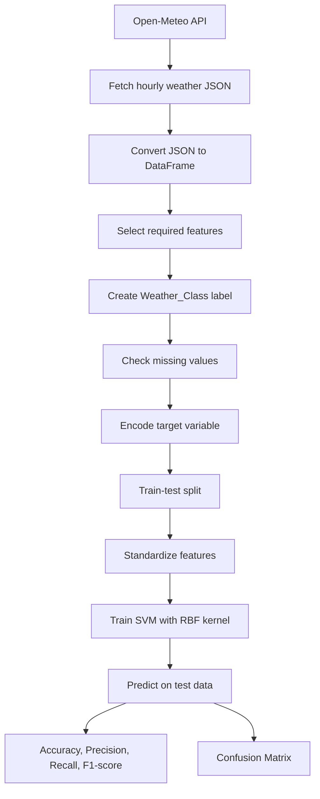
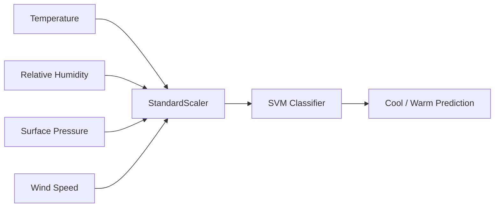
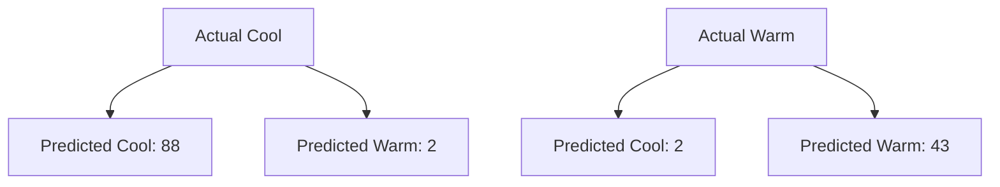

# Assignment 6: Weather Condition Classification using SVM and Open-Meteo API

## Overview
This assignment builds a support vector machine (SVM) classifier that predicts whether weather observations belong to the **Cool** or **Warm** category. The dataset is collected live from the Open-Meteo API, converted into a tabular format, cleaned, scaled, and then used to train an SVM model with an RBF kernel.

## Objective
The goal is to demonstrate a complete machine learning workflow for weather classification:

1. Fetch real-time weather data from a public API.
2. Prepare the dataset for supervised learning.
3. Train an SVM classifier.
4. Evaluate the model with standard classification metrics.

## Problem Statement
A weather analytics company wants to classify weather conditions as Cool or Warm using meteorological observations collected from the Open-Meteo API. A new target column, `Weather_Class`, is created using the temperature threshold:

- **Warm** if temperature is greater than or equal to 25°C
- **Cool** if temperature is below 25°C

## API Documentation
- Open-Meteo API: https://open-meteo.com/

## Data Source
The script uses the Open-Meteo forecast endpoint and collects hourly weather data from multiple locations so that both target classes appear in the dataset.

### Features Used
- Temperature
- Relative Humidity
- Surface Pressure
- Wind Speed

### Target Variable
- `Weather_Class`
- Encoded into a numeric target for model training

## Libraries Used
- `pandas` for data handling
- `requests` for API access
- `scikit-learn` for preprocessing, model training, and evaluation

## Workflow Diagram

## Model Pipeline

## Methodology
1. Fetched hourly weather data from the Open-Meteo API.
2. Combined observations from multiple locations to obtain a balanced class distribution.
3. Converted the JSON response into a Pandas DataFrame.
4. Identified the input features and target variable.
5. Created the `Weather_Class` column based on the 25°C threshold.
6. Checked for missing values and removed unnecessary columns.
7. Encoded the target variable for classification.
8. Split the dataset into 80% training and 20% testing sets.
9. Standardized all feature values using `StandardScaler`.
10. Trained an SVM classifier with an RBF kernel.
11. Evaluated the model using accuracy, precision, recall, F1-score, and a confusion matrix.

## Evaluation Metrics
The latest validated run produced the following results:

- Accuracy: 0.9704
- Precision: 0.9556
- Recall: 0.9556
- F1-Score: 0.9556
- Confusion Matrix: `[[88, 2], [2, 43]]`

### Confusion Matrix Interpretation

The model correctly classified most samples and made only a small number of errors near the class boundary.

## Key Observations
1. Temperature is the strongest feature because the target label is derived from it.
2. Standardization is important because SVM is sensitive to feature scale.
3. Misclassifications are most likely when temperature values are close to the 25°C threshold.

## Conclusion
This experiment showed that Open-Meteo weather data can be used effectively to classify conditions into Cool and Warm categories using an SVM classifier. Temperature was the most influential feature, while humidity, pressure, and wind speed helped define the decision boundary. Feature scaling was essential because SVM relies on distances in transformed feature space, and unscaled values can distort model behavior. One advantage of SVM is that it performs well on small to medium-sized datasets with clear class separation. One limitation is that it can become less interpretable and more expensive to train on large or highly overlapping datasets.

## How to Run
1. Install the required Python packages.
2. Run [Assignment-6.py](Assignment-6.py).
3. Review the printed dataset preview, metrics, and confusion matrix in the console.

## Files Included
- [Assignment-6.py](Assignment-6.py)
- [README.md](README.md)
